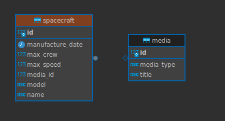

# Spacecraft Maintenance

Es un servicio que permite realizar el mantenimiento de naves espaciales de series y películas.

## Requisitos

* Java 21
* Maven
* Docker y Docker compose

## Introducción

Este servicio permite realizar un CRUD de naves espaciales e indicar si pertenecen a una Serie o Película. Por lo que crearon las siguienes entidades.

### Entidades:
### Media
* Descripción: Almacena los datos de peliculas o series.
* Atributos: 
  * id: Identificador único de la película o serie(clave primaria).
  * title: Título de la película o serie.
  * media_type: tipo de media ("MOVIE" o "SERIE").
* Relación:
  * uno a muchos: Una película o serie puede tener muchas naves espaciales(relación con la entidad "spacecraft").

### Spacecraft
* Descripción: Almacena los datos de las naves espaciales.
* Atributos:
  * id: Identificador único de la nave espacial (clave primaria).
  * name: Nombre de la nave espacial.
  * model: Modelo de la nave espacial.
  * manufacture_date: Fecha de fabricación de la nave espacial.
  * max_crew: Cantidad máxima de tripulación de la nave espacial.
  * max_speed: Velocidad máxima de la nave espacial.
  * media: Referencia a la película o serie a la que pertenece la nave espacial (clave foránea a la entidad Media).
* Relación:
  * Uno a uno: Una nave espacial pertenece a una y solo una película o serie (relación con la entidad Media).

## Seguridad

Se ha implementado Spring Security para añadir autenticación y autorización a la API.

Por defecto, se disponen de los siguientes usuarios:

| Usuario | Rol   | Contraseña |
|---------|-------|------------|
| admin   | ADMIN | admin      |
| user1   | WRITE | user123    |
| user2   | READ  | user999    |

Para llamar a los endpoints solo hay que estar loguado.

Los usuarios pueden ser gestionados mediante los endpoints correspondientes, teniendo en cuenta que solo los usuarios con el rol `ADMIN` podrán dar de alta a nuevos usuarios.

Para ver todos los usuarios, simplemente es necesario estar autenticado en el sistema.

## Levantar el servicio

* **levantar el servicio**:

      `docker-compose up --build`

Con **docker-compose** se va a levantar la Base de Datos PostgreSQL, Kafka y la Aplicación.

## Swagger
Al levantar el proyecto, podemos acceder al Swagger desde http://localhost:8080/swagger-ui/index.html#

## Reporte de Cobertura
* Ejecutar reporte

  `mvn clean verify`
* Abrir reporte
 
  * El reporte se encuentra disponible en:  `target/site/jacoco/index.html`

## Migracion de Base de Datos
En este proyecto se utilizó Flyway como gestor de script para migración de BD.

* Ver información de las migraciones:

  `mvn flyway:info`

* Ejecutar migración:

  `mvn flyway:migrate`